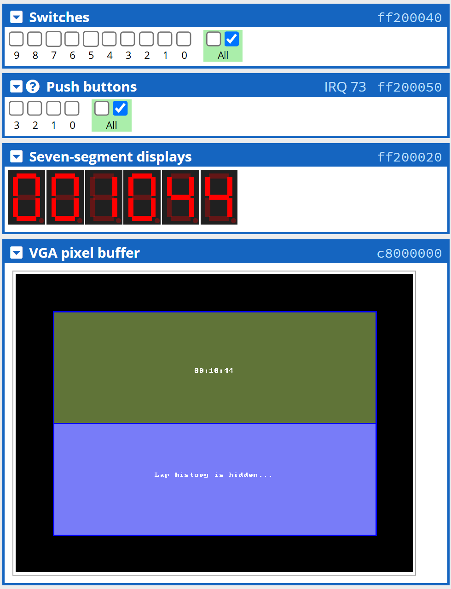
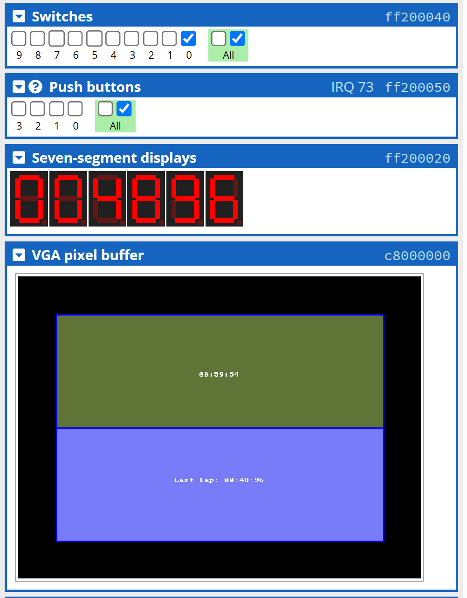

# Apps for ARMv7 DE1-SoC Board #3️⃣ (Timer)

## Descriptions 📋

This is a **timer** application including **lap mode** that was written in both **Assembly** and **C**, which is *technically* runnable on a DE1-SoC Kit that has **ARM Cortex-A9** processor integrated.

As you can see in this `branch`, there are ***different folders*** containing ***different kinds of source codes*** that are named as *"Version 1.0"*, *"Version 2.0"*, etc. This shows how I built this app following the **MVP (Minimum Viable Product)** strategy towards the final version, which means *all the early versions are also runnable*, but the **new functionalities** are added partially in the next version based on **testing** and **refining**.

## Features ⚙

### Version 1.0 (What the app does?)

1. **Start** ```(KEY0)```, **pause** ```(KEY1)```, **record the lap** ```(KEY2)```, and **reset** ```(KEY3)``` the timer.
2. **Map** the timer's **numbers** on the seven-segment displays.
3. Able to **show the last recorded lap** ```(SW0)``` on the seven-segment displays rather than timer.


### Version 2.0 (What was added from Version 1.0?)

1. **Draw** the timer's and lap mode's **text** on **VGA pixel buffer**.
2. **Align** the texts **to the centre**, and **draw borders** to split the area of displaying timer and lap.
3. **Hide** the **lap history** if the switch ```(SW0)``` is off.

### Version 3.0 (What was added from Version 2.0?)

1. **Enhance the visual effects** to be more colourful.

## Installation 📥

> ##### Reminder: To get a better user experience, please use the C code instead of Assembly code (Assembly code may be laggy when you switch the source code without refreshing on [CPUlator](https://cpulator.01xz.net/?sys=arm-de1soc).), and choose the latest version for full functionalities (Largest number ≡ Latest version).

Although you have to download the source code locally on your device, you don't have to download any simulator locally to test the code. Instead, we will be using [CPUlator](https://cpulator.01xz.net/?sys=arm-de1soc) to simulate the ARMv7 DE1-SoC environment.

###### For the operation of this game, I have actually mentioned how to play it in the `Features` section, can you figure it out yourself?

## Stories Behind the Work 📠

The earlier version ```(Version 1.0)``` of the timer app was **originally written** for one of the assignments of my university course —— ***Microprocessors and Microcomputers***.

The original assignment asked to implement visual outputs **only on** seven-segment displays. As I **searched more information** about ARM Cortex-A9 processor and DE1-SoC Kit, I think the earlier version is kind of simple and crude, and I can *definitely* design and **build a much more powerful version**...

The ***most complex part*** that I've further developed ```(If you are curious about it...)``` is figuring out **how to switch the text outputs** for the lap mode based on status of the switch ```(SW0)``` because there are 2 different lines of text for the lap mode, and the new text cannot fully cover the old one when I toggle the switch. **The solution** is to ***clear the pixels only on that specific line of texts*** instead of clearing the entire buffer, which would cause lags when refreshing.

## Screenshots (Final Version) 📸



