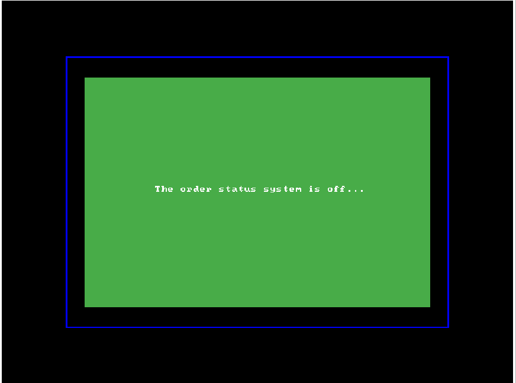
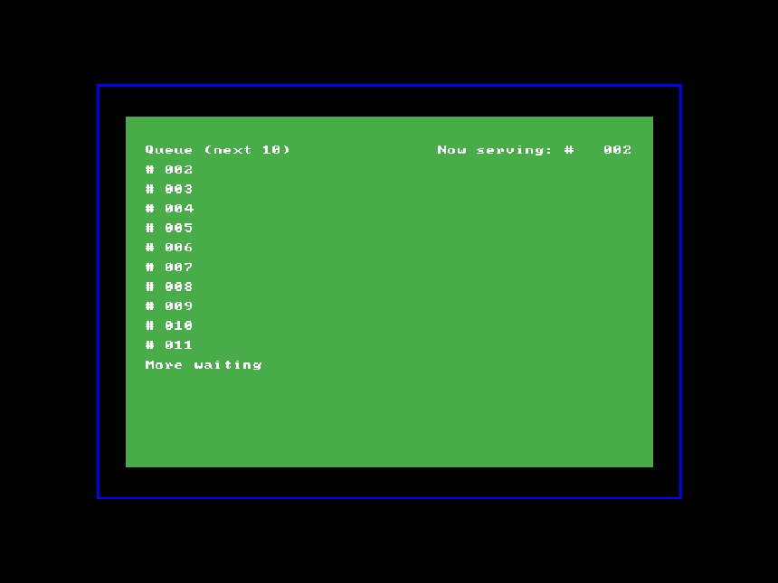
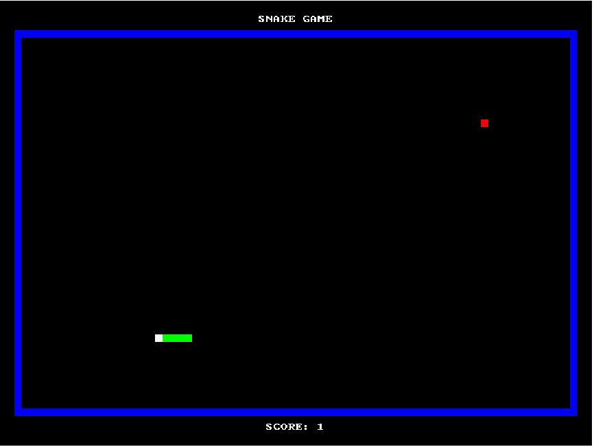
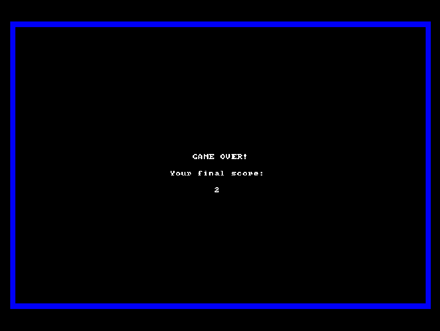
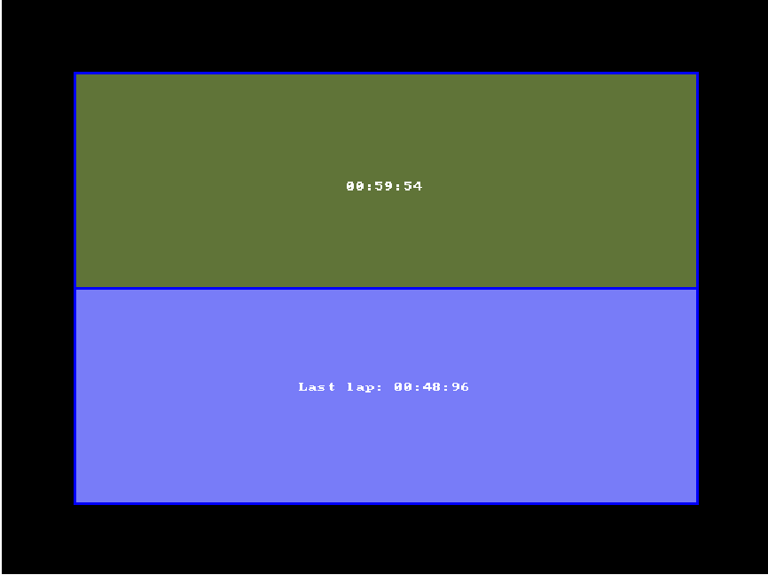
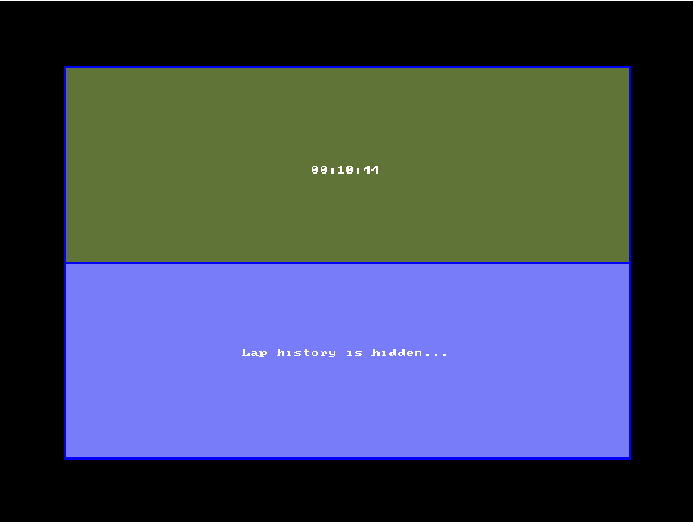

###### Belows are my instructions and notes for every user (*player*)  who wants to know more.

# Apps for ARMv7 DE1-SoC Board

## Descriptions 📋

This `branch` contains several applications that were written in both **Assembly** and **C** language, which are *technically* runnable on a DE1-SoC Kit that has **ARM Cortex-A9** processor integrated.

As you can see inside each folder, there are ***different subfolders*** containing ***different kinds of source codes*** that are named as *"Version 1.0"*, *"Version 2.0"*, etc. This shows how I built this app following the **MVP (Minimum Viable Product)** strategy towards the final version, which means *all the early versions are also runnable*, but the **new functionalities** are added partially in the next version based on **testing** and **refining**.

## Features (Final Version) ⚙

### App #1️⃣ (Order Status System）

1. **Draw** the queued and serving orders on **VGA pixel buffer**.
2. **Add, remove** and **clear orders** using buttons ```(KEY0 ~ KEY3)```.
3. **Turn on/off** the **order status system** using switches ```(SW0)```.
4. **Enhance** the **text alignments** and **visual effects**.


### App #2️⃣ (Snake Game）

1. **Draw** the snake game, title, and live score on **VGA pixel buffer**.
2. **Turn the direction, pause** and **clear timer** using buttons ```(KEY0 ~ KEY3)```.
3. **Turn on/off** the **snake game** using switches ```(SW0)```.
4. **Enhance** the **text alignments** and **visual effects**.

### App #3️⃣ (Timer)

1. **Draw** the timer and lap history on **VGA pixel buffer**.
2. **Start, pause, record lap** and **restart game** using buttons ```(KEY0 ~ KEY3)```.
3. **Show/hide** the **lap history** using switches ```(SW0)```.
4. **Enhance** the **text alignments** and **visual effects**.

###### For more details of what the earlier versions do and what new features were added towards the final version, please visit the related `branch` for each application.

## Installation 📥

> ##### Reminder: To get a better user experience, please use the C code instead of Assembly code (Assembly code may be laggy when you switch the source code without refreshing on [CPUlator](https://cpulator.01xz.net/?sys=arm-de1soc).), and choose the latest version for full functionalities (Largest number ≡ Latest version).

Although you have to download the source code locally on your device, you don't have to download any simulator locally to test the code. Instead, we will be using [CPUlator](https://cpulator.01xz.net/?sys=arm-de1soc) to simulate the ARMv7 DE1-SoC environment.

###### For the operation of every application, I have left the instructions inside each `branch`, can you navigate to each of them and try to find it out yourself?

## Stories Behind the Work 📠

Since the `main` branch acts like a bundle that contains all source codes based on other branches. I will **leave the "stories"** for each application **under its related branch** for those who wants to know more about how I come up ideas to write applications for microcomputers.

## Screenshots 📸

 

 

 
