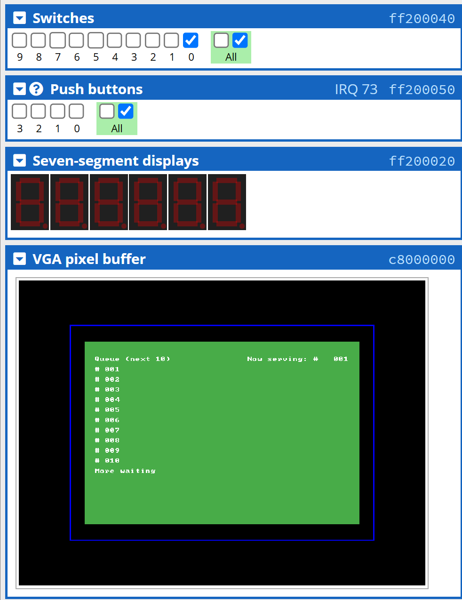
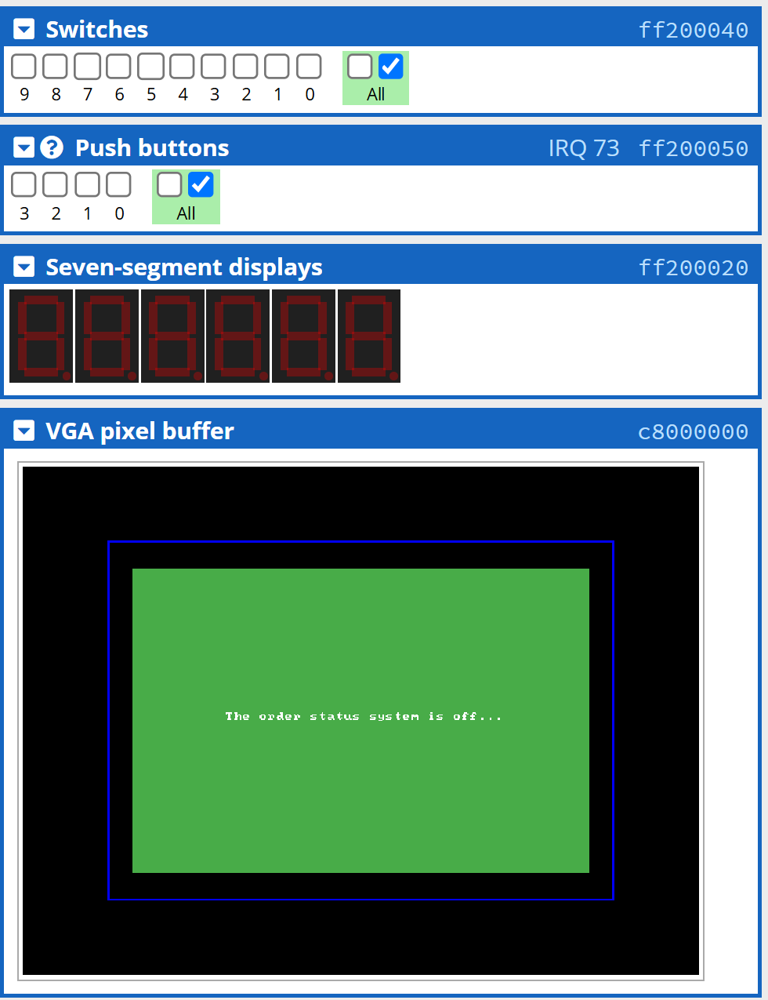

# Apps for ARMv7 DE1-SoC Board #1️⃣ (Order Status System)

## Descriptions 📋

This is an **Order Status System** application that was written in both **Assembly** and **C** that is *technically* runnable on a DE1-SoC Kit which has **ARM Cortex-A9** processor integrated.

As you can see in this `branch`, there are ***different folders*** containing ***different kinds of source codes*** that are named as *"Version 1.0"*, *"Version 2.0"*, etc. This shows how I built this app following the **MVP (Minimum Viable Product)** method towards the final version, which means *all the early versions are also runnable*, but the **new functionalities** are added partially in the next version based on **testing** and **refining**. 

## Features ⚙

### Version 1.0 (What the app does?)

1. Make order status **displaying** on **VGA pixel buffer**.
2. **Add** ```(KEY0)```, **remove** ```(KEY1)``` an order, or **clear** ```(KEY2)``` all orders from list on the monitor.
3. **Hide latest orders** if exceeds displaying limits (tentatively 10 orders).
4. **Show** the **current processing** order.
5. **Display "FULL"** on seven-segment displays if reaches total order limits (tentatively 20 orders).

### Version 2.0 (What was added from Version 1.0?)

1. **Align** the displaying orders **to the centre** of the screen.
2. **Enhance the screen background** to be more colourful.
3. Able to **turn off the OSS** ```(SW0)``` if you don't need it working. Automatically clear the order history after turning off.

## Installation 📥

> ##### Reminder: To get a better user experience, please use the C code instead of Assembly code (Assembly code may be laggy when you switch the source code without refreshing on [CPUlator](https://cpulator.01xz.net/?sys=arm-de1soc).), and choose the latest version for full functionalities (Largest number ≡ Latest version).

Although you have to download the source code locally on your device, you don't have to download any simulator locally to test the code. Instead, we will be using [CPUlator](https://cpulator.01xz.net/?sys=arm-de1soc) to simulate the ARMv7 DE1-SoC environment.

###### For the operation of this app, I have actually mentioned how to *play* this app in the `Features` section, can you figure it out yourself?

## Stories Behind the Work 📠

The earlier version ```(Version 1.0)``` of this OSS app was **originally written** for the final project of my university course —— ***Microprocessors and Microcomputers***, which the ```Version 1.0``` is co-authored with my colleague, [@JakeNizio](https://github.com/JakeNizio).

However, I think the original version is kind of simple and crude. So, I added more visual effects and user interactions for the final version ```(Version 2.0)```.

## Screenshots (Final Version) 📸



