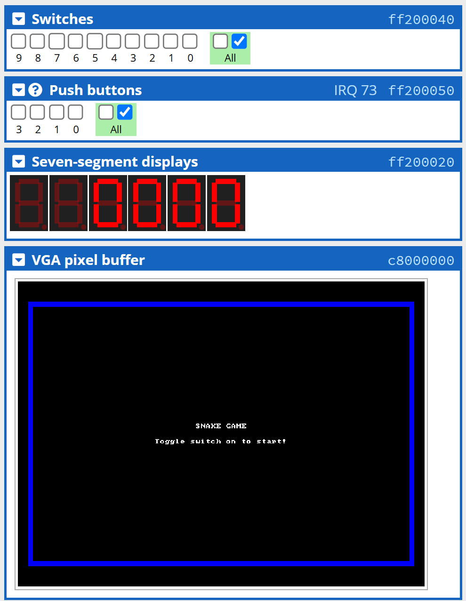
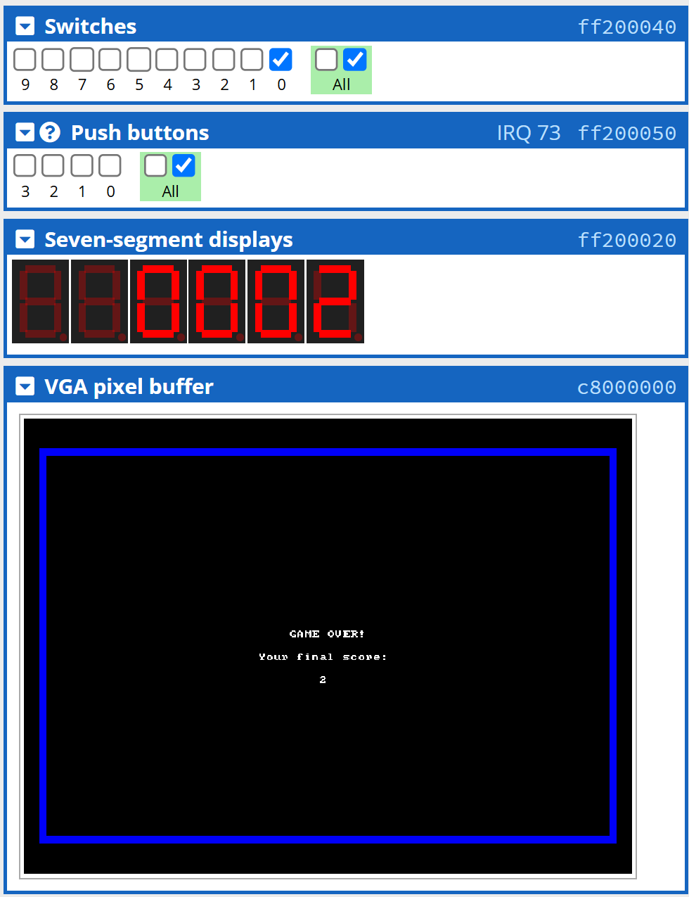

# Apps for ARMv7 DE1-SoC Board #2️⃣ (Snake Game)

## Descriptions 📋

This is a **Snake game** that was written in both **Assembly** and **C** that is *technically* runnable on a DE1-SoC Kit which has **ARM Cortex-A9** processor integrated.

As you can see in this `branch`, there are ***different folders*** containing ***different kinds of source codes*** that are named as *"Version 1.0"*, *"Version 2.0"*, etc. This shows how I built this app following the **MVP (Minimum Viable Product)** strategy towards the final version, which means *all the early versions are also runnable*, but the **new functionalities** are added partially in the next version based on **testing** and **refining**.

###### Let's see what is the highest score you can achieve in my snake game (for the final version)? 😁

## Features ⚙

### Version 1.0 (What the app does?)

1. **Design** the basic **logic** of snake game for ARMv7 DE1-SoC board.
2. **Assign buttons** ```(KEY0 ~ KEY3)``` to **manipulate** snake's direction.
3. **Implement situation** when game is over.

### Version 2.0 (What was added from Version 1.0?)

1. **Design** a more reasonable snake **turning logic**. (Only need to press ```KEY0``` and ```KEY1``` for turning.)
2. **Add wall frames** to restrict snake's moving area. **Display title** and **live scores** while playing.
3. **Implement** the game **pause** ```(KEY2)``` and **restart** ```(KEY3)``` functionalities.
4. Able to **close the game** ```(SW0)``` if you don't want to play. Automatically clear the previous game round after turning off.

### Version 3.0 (What was added from Version 2.0?)

1. **Fix screen blinking issues** during gaming.
2. **Fix slow speed issues** for Assembly code.

## Installation 📥

> ##### Reminder: To get a better user experience, please use the C code instead of Assembly code (Assembly code may be laggy when you switch the source code without refreshing on [CPUlator](https://cpulator.01xz.net/?sys=arm-de1soc).), and choose the latest version for full functionalities (Largest number ≡ Latest version).

Although you have to download the source code locally on your device, you don't have to download any simulator locally to test the code. Instead, we will be using [CPUlator](https://cpulator.01xz.net/?sys=arm-de1soc) to simulate the ARMv7 DE1-SoC environment.

###### For the operation of this game, I have actually mentioned how to play it in the `Features` section, can you figure it out yourself?

## Stories Behind the Work 📠

After building the final version of Order Status System for ARMv7 DE1-SoC environment (See more information in `oss` branch.), I started to **search for more information** about ARM Cortex-A9 processor and DE1-SoC Kit, see if I can **design** and **build another "powerful" application** under this environment. 

As **most of us likes gaming** ```(And decided to study software in the university because of this...)```, the idea of making a simple game for ARMv7 DE1-SoC environment comes out. 

Since I don't own a physical microcomputer, and I can only use the peripherals available on the [CPUlator](https://cpulator.01xz.net/?sys=arm-de1soc), **snake game** could possibly be the easiest game to implement on the DE1-SoC Kit in my opinion.

###### And this is probably the hardest Assembly/C coding for microcomputer I have made so far...

## Screenshots (Final Version) 📸




